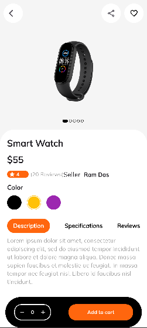
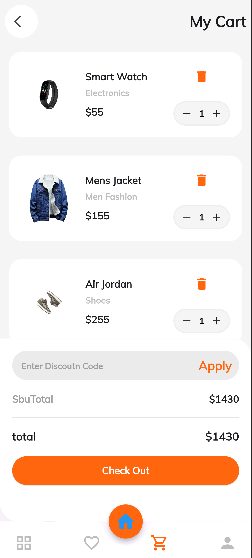

# SIMPLE E-COMMERCE APP

### This Simple E-Commerce App is a lightweight application built using the Flutter framework, designed to showcase a curated collection of programming languages as products. It allows users to browse the list, mark their favorites, and add selected items to their cart. The app uses Provider for state management and firebase firestore as a database and supports realtime data updates.
## Screenshots.

  
  

  
  

## Table of Contents
- [Features](#features)
- [Installation](#installation)
- [Usage](#usage)
- [Contributing](#contributing)
- [License](#license)

## Features
- **Home Screen**: Displays product categories and list of category items for users.
- **Product Details**: Detailed view with product description, specifications, reviews, and a color selector.
- **Favorites**: Allows users to save their favorite items for quick access.
- **Interactive UI**: Clean, modern, and intuitive design for a seamless user experience.
- **Add to Cart**: Easily add products to your shopping cart.

## Installation
1. Clone the repo: `git clone https://github.com/chalaAlex/BMI-Calculator.git`
2. Navigate to the project folder: `cd BMI-Calculator`
3. Install dependencies: `flutter pub get`

## Usage
- Run the app with `flutter run`.

## Contributing
Contributions are welcome! Fork the repo and submit a pull request.

## License
This project is licensed under the GNU License.
